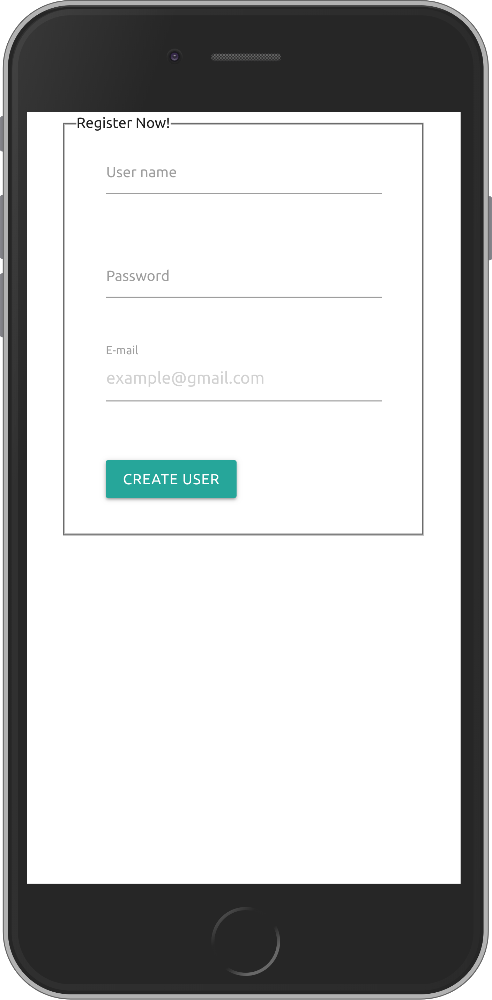

[![Contributors][contributors-shield]][contributors-url]
[![Forks][forks-shield]][forks-url]
[![Stargazers][stars-shield]][stars-url]
[![Issues][issues-shield]][issues-url]
[![LinkedIn][linkedin-shield]][linkedin-url]
[![LinkedIn][linkedin-shield2]][linkedin-url2]

<!-- PROJECT LOGO -->
 

  <h2 align="center"> Bare Metal Forms and Helpers </h2>
  

      Creating a User Form with the backend needed to store the information. With focus on the new user and Edit User forms... See it in action!!!
     
    <a href="https://github.com/kitpao/Bare-Metal-Forms-and-Helpers-re-former"><strong>Explore the docs »</strong></a>
     
     
    <a href="https://github.com/kitpao/Bare-Metal-Forms-and-Helpers-re-former">View Demo</a>
    ·
    <a href="https://github.com/kitpao/Bare-Metal-Forms-and-Helpers-re-former/issues">Report Bug</a>
    ·
    <a href="https://github.com/kitpao/Bare-Metal-Forms-and-Helpers-re-former/issues">Request Feature</a>
  

## Table of Contents
* [About the Project](#about-the-project)
  * [Built With](#built-with)
* [Usage](#usage)
* [Roadmap](#roadmap)
* [Contact](#contact)
* [Acknowledgements](#acknowledgements)
<!-- ABOUT THE PROJECT -->

## About The Project
<small>(Click on the image to play with the code! See instructions in [Usage](#usage))</small>
[![Product Name Screen Shot][product-screenshot]](https://ebdc5552-4e26-4884-95c9-44834d9c8c6e.ws-us02.gitpod.io/#/workspace/Bare-Metal-Forms-and-Helpers-re-former)

In this project we developed a simple form for our create and edit routes:
* The form uses Materialize library for css combined with embedded ruby code
* The back end is set up with a User model that validates presence of username, email and password
* The form was implemented with different rails helpers methods such as form_for, form_tag, form_with, as seen in the git commit history.
* If you click on the link provided for the creation or update of users you can test the validations and create your own users
* The form is responsive to the screen

Here is a screenshot of the page seen in a small device:  

### Built With
The project was developed using the following technologies:
- [RUBY](https://www.ruby-lang.org/es/)
- [RUBOCOP LINTERN](https://github.com/microverseinc/linters-config/tree/master/ruby)
- [RAILS](https://rubyonrails.org/)
- [Materialize library](https://materializecss.com/)

## Usage

Click on the image at the top or in the following [link](https://ebdc5552-4e26-4884-95c9-44834d9c8c6e.ws-us02.gitpod.io/#/workspace/Bare-Metal-Forms-and-Helpers-re-former),

* Click on the terminal and type `rails server` and hit enter to begin the server
* When the process is done, you can enter here for creating new users: [new user -> localhost/users/new](https://3000-ebdc5552-4e26-4884-95c9-44834d9c8c6e.ws-us02.gitpod.io/users/new) to watch the webpage
* Or you can enter here to edit existing users: [edit user -> localhost/users/1/edit](https://3000-ebdc5552-4e26-4884-95c9-44834d9c8c6e.ws-us02.gitpod.io/users/1/edit) to watch the webpage

Now you can test directly in the browser!!

## Roadmap

See the [open issues](https://github.com/kitpao/Bare-Metal-Forms-and-Helpers-re-former/issues) for a list of proposed features (and known issues).

## Contact

  Project Link: [https://github.com/kitpao/Bare-Metal-Forms-and-Helpers-re-former](https://github.com/kitpao/Bare-Metal-Forms-and-Helpers-re-former)

  Kitzia Paola Vidal Marroquin - [Github user: kitpao](https://github.com/kitpao)

    <a target="_blank" href="https://mail.google.com/mail/?view=cm&fs=1&tf=1&to=kitpao91@gmail.com">
      kitpao91@gmail.com
    </a> &nbsp; |
    <a target="_blank" href="https://github.com/kitpao/Personal_Projects">
        Portfolio
    </a> &nbsp; |
    <a target="_blank" href="https://www.linkedin.com/in/kitzia-paola-vidal/">
      LinkedIn
    </a> &nbsp; |
    <a target="_blank" href="https://twitter.com/Kitpao1">
      Twitter
    </a>

  Jesus Eduardo Cruz Valdez - [EdCrux](https://github.com/EdCrux
)

    <a target="_blank" href="https://mail.google.com/mail/?view=cm&fs=1&tf=1&to=jecruxiz@gmail.com
">
      jecruxiz@gmail.com
    </a> &nbsp; |
    <a target="_blank" href="https://github.com/EdCrux?tab=repositories">
        My Repositories
    </a> &nbsp; |
    <a target="_blank" href="www.linkedin.com/in/edcrux">
      LinkedIn
    </a> &nbsp; |
    <a target="_blank" href="https://twitter.com/edcrux8">
      Twitter
    </a>

## Acknowledgements
- [Microverse curriculum Rails section](https://www.microverse.org/?grsf=6ns691)
- [The Odin project: Building with active record ruby on rails](https://www.theodinproject.com/courses/ruby-on-rails/lessons/building-with-active-record-ruby-on-rails
)
- [Rails Guides](https://guides.rubyonrails.org)
- [Materialize library](https://materializecss.com/)

<!-- MARKDOWN LINKS & IMAGES -->
[contributors-shield]: https://img.shields.io/github/contributors/kitpao/Bare-Metal-Forms-and-Helpers-re-former.svg?style=flat-square
[contributors-url]: https://github.com/kitpao/Bare-Metal-Forms-and-Helpers-re-former/graphs/contributors
[forks-shield]: https://img.shields.io/github/forks/kitpao/Bare-Metal-Forms-and-Helpers-re-former.svg?style=flat-square
[forks-url]: https://github.com/kitpao/Bare-Metal-Forms-and-Helpers-re-former/network/members
[stars-shield]: https://img.shields.io/github/stars/kitpao/Bare-Metal-Forms-and-Helpers-re-former.svg?style=flat-square
[stars-url]: https://github.com/kitpao/Bare-Metal-Forms-and-Helpers-re-former/stargazers
[issues-shield]: https://img.shields.io/github/issues/kitpao/Bare-Metal-Forms-and-Helpers-re-former.svg?style=flat-square
[issues-url]: https://github.com/kitpao/Bare-Metal-Forms-and-Helpers-re-former/issues
[license-shield]: https://img.shields.io/github/license/kitpao/Bare-Metal-Forms-and-Helpers-re-former.svg?style=flat-square
[license-url]: https://github.com/kitpao/Bare-Metal-Forms-and-Helpers-re-former/blob/master/LICENSE.txt
[linkedin-shield]: https://img.shields.io/badge/-LinkedIn-black.svg?style=flat-square&logo=linkedin&colorB=555
[linkedin-url]: https://www.linkedin.com/in/kitzia-paola-vidal/
[linkedin-shield2]: https://img.shields.io/badge/-LinkedIn-black.svg?style=flat-square&logo=linkedin&colorB=555
[linkedin-url2]: https://www.linkedin.com/in/edcrux/
[product-screenshot]: screenshot.png
[product-example]: image.png

